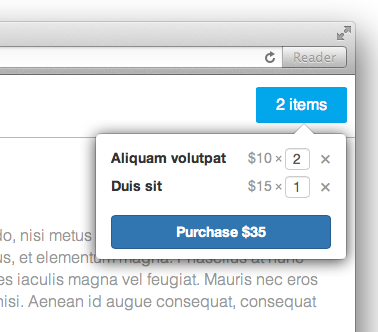

Cart Widget turning any Site into Shop.



## Installation

1. Install NodeJS
2. Install dependencies `npm install`
3. Run server `node server.js`
4. Open `shop.html` in browser.

## TODO

- Add format.js and proper phone number validation.
- Add mail notification for the user if he provides email.
- Add ability to set if field required.

## Project history

Detailed [explanation](http://jslang.info/projects/salejs) of every step in the history
of the project. Also, there's a git tag for every step - type `git checkout <tag-name>`
and `git checkout master` to set project to the latest state.

- HTML Mockups - `html-mockups`.

## How to add language

1. Add new language to `client/languages`.
2. Add new language to `server/languages`.

## How to install NodeJS

We need it to use LESS, and as our web server.

Don't use NodeJS pre-packaged installer because it will install it with sudo and
you don't want that, also don't install it via `brew` or other package manager because
for some reason unknown to me all of them install it somehow wrongly.
It's better to built NodeJS from sources.

``` Bash
wget http://nodejs.org/dist/vX.X.X/node-vX.X.X.tar.gz
tar -xzf node-vX.X.X.tar.gz
cd node-vX.X.X
./configure
make
make install
```

## How to install LESS

NodeJS should be installed, then type `npm install less -g`

## How to namespace Twitter Bootstrap styles

Download Twitter Bootstrap http://getbootstrap.com, go to `css` folder, create
`bootstrap.less` file and copy content of `bootstrap.css` there (LESS is superset of CSS so it will be fine).

Create file `bootstrap-widget.less` and put import bootstrap styles into namespace.

``` CSS
.bootstrap-widget {@import "./bootstrap.less";}
```

Now run LESS and convert it to CSS

``` Bash
lessc bootstrap-widget.less > bootstrap-widget.css
```

You should get file `bootstrap-widget.css` with all bootstrap styles put under
the `bootstrap-widget` namespace.

# Contributors

- Arthur Kohansky

Copyright (c) Alexey Petrushin, http://petrush.in, released under the MIT license.
